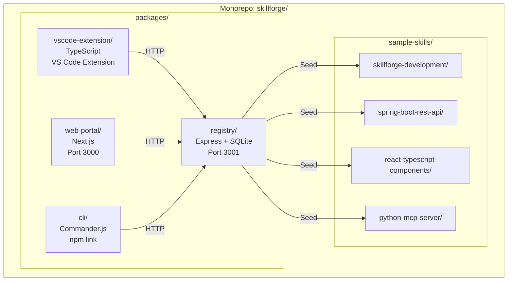

# SkillForge — Demo Implementation Plan

## Goal

Build a fully functional demo of **SkillForge** — an internal platform for managing and distributing AI copilot skill files (`.md` instructions for GitHub Copilot). The demo must showcase all functional capabilities to leadership for approval.

## Scope Decisions

| Area | Decision |
|------|----------|
| **Auth** | None for demo |
| **Hosting** | Local only (all components run on localhost) |
| **LLM Pipeline** | TODO — not implemented. Classification/validation are manual |
| **Target IDE** | GitHub Copilot only |
| **Database** | SQLite (file-based, zero-config) |
| **Scale** | Not a concern — demo project |
| **Visibility** | Internal tool only |

## Architecture



## Monorepo Structure

```
SkillSearch/
├── package.json                    # Root workspace config
├── IMPLEMENTATION_PLAN.md          # This file
├── .github/
│   └── copilot-instructions.md     # Meta-skill (project itself)
├── sample-skills/                  # Seed data
│   ├── skillforge-development/     # ✅ Created
│   ├── spring-boot-rest-api/       # ✅ Created
│   ├── react-typescript-components/# ✅ Created
│   └── python-mcp-server/         # ✅ Created
├── packages/
│   ├── registry/                   # Backend API
│   │   ├── package.json
│   │   ├── src/
│   │   │   ├── index.js            # Express app entry
│   │   │   ├── db.js               # SQLite setup + migrations
│   │   │   ├── seed.js             # Seed sample skills & personas
│   │   │   ├── routes/
│   │   │   │   ├── skills.js
│   │   │   │   ├── packages.js
│   │   │   │   └── personas.js
│   │   │   └── services/
│   │   │       ├── skills.js
│   │   │       └── packages.js
│   │   └── data/                   # SQLite DB + uploaded files
│   │       └── skillforge.db
│   ├── web-portal/                 # Frontend
│   │   ├── package.json
│   │   ├── next.config.js
│   │   └── src/app/
│   │       ├── layout.tsx          # Root layout with nav
│   │       ├── page.tsx            # Home / catalog
│   │       ├── globals.css         # Design system
│   │       ├── skills/
│   │       │   └── [id]/page.tsx   # Skill detail
│   │       ├── packages/
│   │       │   └── page.tsx        # Package catalog
│   │       └── publish/
│   │           └── page.tsx        # Publish wizard
│   ├── vscode-extension/           # VS Code Extension
│   │   ├── package.json            # Extension manifest
│   │   ├── src/
│   │   │   ├── extension.ts        # Activation & commands
│   │   │   ├── providers/
│   │   │   │   └── skillTreeProvider.ts  # Sidebar tree view
│   │   │   ├── commands/
│   │   │   │   ├── install.ts
│   │   │   │   ├── publish.ts
│   │   │   │   └── browse.ts
│   │   │   └── api/
│   │   │       └── registryClient.ts     # HTTP client for API
│   │   └── tsconfig.json
│   └── cli/                        # CLI Tool
│       ├── package.json
│       └── src/
│           ├── index.js            # Entry point
│           ├── commands/
│           │   ├── search.js
│           │   ├── install.js
│           │   ├── publish.js
│           │   ├── list.js
│           │   └── init.js
│           └── utils/
│               └── api.js          # HTTP client
```

---

## Proposed Changes

### Component 1: Registry API

The central backend. All other components consume this.

#### [NEW] packages/registry/package.json
- Express, better-sqlite3, cors, multer (file uploads), uuid, yaml (for parsing skill.yaml)

#### [NEW] packages/registry/src/db.js
- SQLite initialization with `better-sqlite3`
- Schema creation: `personas`, `skills`, `packages`, `package_skills` tables
- Auto-migrate on startup

#### [NEW] packages/registry/src/seed.js
- Seeds persona taxonomy (java-spring, react, python, data, hogan + sub-personas)
- Reads `sample-skills/` directories and inserts them
- Creates two sample packages: `java-spring-fullstack` and `react-fullstack`

#### [NEW] packages/registry/src/routes/skills.js
- `GET /api/skills` — List with query filters (persona, search, tags)
- `POST /api/skills` — Publish: accepts multipart form (skill.yaml + instruction.md + optional examples). Parses YAML, generates README from description, stores in DB
- `GET /api/skills/:id` — Detail view
- `DELETE /api/skills/:id` — Remove skill

#### [NEW] packages/registry/src/routes/packages.js
- `GET /api/packages` — List packages
- `POST /api/packages` — Create package
- `GET /api/packages/:id` — Detail with resolved skills
- `POST /api/packages/:id/skills` — Add skill to package
- `DELETE /api/packages/:id/skills/:skillId` — Remove skill from package
- `GET /api/packages/:id/download` — Download as zip (using `archiver`)

#### [NEW] packages/registry/src/routes/personas.js
- `GET /api/personas` — Full taxonomy tree

#### [NEW] packages/registry/src/index.js
- Express app setup with CORS, JSON/multipart parsing
- Mount all routes
- Seed on first run
- Listen on port 3001

---

### Component 2: Web Portal

A visually impressive Next.js frontend for browsing, searching, and publishing skills.

#### [NEW] Next.js App (initialized via `npx create-next-app@latest`)
- App Router, TypeScript, ESLint

#### [NEW] src/app/globals.css
- Premium dark-mode design system
- CSS custom properties for colors, typography, spacing
- Glassmorphism cards, smooth gradients, micro-animations
- Inter font from Google Fonts

#### [NEW] src/app/layout.tsx
- Root layout with sidebar navigation
- Links: Catalog, Packages, Publish
- Logo + branding

#### [NEW] src/app/page.tsx
- Skills catalog: search bar + persona filter chips + skill cards grid
- Each card shows: name, description, persona badge, tags, author, install count
- Click to navigate to detail page

#### [NEW] src/app/skills/[id]/page.tsx
- Full skill detail: rendered markdown preview, metadata sidebar, install button
- Shows: full instruction.md rendered, skill.yaml details, examples

#### [NEW] src/app/packages/page.tsx
- Package catalog: cards with skill count, persona, curator
- Expand to see included skills
- Download package button

#### [NEW] src/app/publish/page.tsx
- Multi-step publish wizard:
  1. Upload `.md` file (drag & drop)
  2. Enter name, description
  3. Select persona from dropdown (manual — no LLM)
  4. Add tags
  5. Preview generated skill.yaml + README.md
  6. Submit

---

### Component 3: VS Code Extension

#### [NEW] Extension scaffold
- TypeScript extension using `@vscode/vscode` API
- `contributes`: commands, viewsContainers, views, menus

#### [NEW] Skill Explorer (sidebar TreeView)
- Tree: Persona → Sub-persona → Skills
- Each skill node shows name + description
- Right-click context menu: Install, View Details
- Search box at top

#### [NEW] Commands
- `skillforge.install` — Install a skill: downloads instruction.md to `.github/copilot-instructions.md` (or prompts for location)
- `skillforge.publish` — Opens active `.md` file, prompts for metadata, publishes to registry
- `skillforge.browse` — Opens the web portal in browser
- `skillforge.installPackage` — Pick a package, install all skills

---

### Component 4: CLI Tool

#### [NEW] CLI (distributed via npm link for demo)

```
skillforge search <query>           # Full-text search
skillforge browse [--persona X]     # Browse skills
skillforge install <skillName>      # Install skill to current workspace
skillforge install --package <name> # Install full package
skillforge list                     # Show installed skills
skillforge publish <directory>      # Publish a skill directory
skillforge init                     # Scaffold a new skill (skill.yaml + instruction.md)
```

- Colorful output with `chalk`
- Table formatting with `cli-table3`
- Interactive prompts with `inquirer` (for init/publish)

---

## Phased Build Order

### Phase 1: Registry API + Seed Data
1. Initialize monorepo with npm workspaces
2. Build registry: db setup, routes, services
3. Seed personas + sample skills
4. Test all endpoints with curl/REST client

### Phase 2: Web Portal
1. Initialize Next.js project
2. Design system (globals.css)
3. Layout + navigation
4. Catalog page (browse + search + filter)
5. Skill detail page
6. Package page
7. Publish wizard

### Phase 3: CLI Tool
1. Command scaffolding with commander
2. Implement search, install, publish, list, init
3. Test end-to-end flow

### Phase 4: VS Code Extension
1. Extension scaffold
2. Sidebar tree provider
3. Install + publish commands
4. Integration testing

### Phase 5: Polish & Demo Prep
1. Seed more skills if needed
2. Verify all flows work end-to-end
3. Record demo video / prepare walkthrough

---

## Verification Plan

### Automated Tests
- Registry: Test each endpoint using curl commands after startup
- CLI: Test `skillforge search`, `install`, `publish` flow
- Web Portal: Visually verify in browser

### End-to-End Flows to Demo
1. **Browse & Install**: Open extension → browse by persona → install a Spring Boot skill → verify `.github/copilot-instructions.md` is created
2. **Search & Install via CLI**: `skillforge search "react"` → `skillforge install react-typescript-components`
3. **Publish via Web Portal**: Upload a new `.md` file → fill metadata → select persona → publish → see it appear in catalog
4. **Package Install**: Install `java-spring-fullstack` package → verify all skills installed
5. **Publish via CLI**: `skillforge init` → edit files → `skillforge publish ./` → verify in portal
